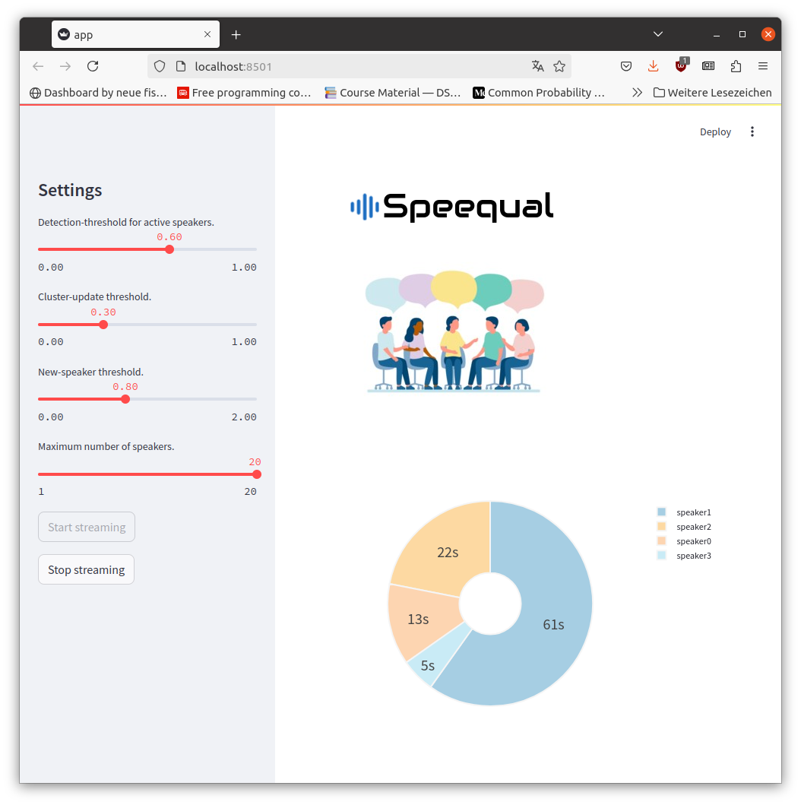

# Speequal - Promoting Fair Conversations


Speequal is an app that gives users a real-time overview of the share each speaker has in a conversation. It is intended to help us to make conversation more equitable and fair.

The app was developed as part of the neuefische Data Science, Machine Learning & AI Bootcamp 2024 in Hamburg. 


## Developers

Speequal was developed by:

- Christian Reimann: https://github.com/christian-reimann
- Jakob Koscholke: https://github.com/jottemka

Notice, however, that the heart of the app is the diart framework:
 
 - https://github.com/juanmc2005/diart

## Running The App



To run the app, navigate to the "streamlit" folder and execute the following command:

`streamlit run app.py`

You can then start monitoring a conversation via microphone or by feeding an audio signal into the app and then clicking the "Start streaming" button. To stop, simply click the "Stop streaming" button.

## Fine-Tuning

There are a number of settings that can be fine-tuned for better performance:

1. Detection Threshold for Active Speakers: high values mean that short utterances will not be detected as speech.
2. Cluster-Update Threshold: low values mean that the cluster centroid is easier to shift. 
3. New-Speaker Threshold: lower values mean that more speaker labels will be generated.
4. Maximum Number of Speakers: upper limit of speakers.

## Environment Setup
This repo contains a requirements.txt file with a list of all the packages and dependencies you will need.

Before you can start with plotly in Jupyter Lab you have to install node.js (if you haven't done it before). Check **Node version**  by run the following commands:

```sh
node -v
```

If you haven't installed it yet, begin at `step_1`. Otherwise, proceed to `step_2`.


### **`macOS`** type the following commands : 


`Step_1:` Update Homebrew and install Node by following commands:

```sh
brew update
brew install node
```

`Step_2:` Install the virtual environment and the required packages by following commands:

```BASH
pyenv local 3.11.3
python -m venv .venv
source .venv/bin/activate
pip install --upgrade pip
pip install -r requirements.txt
```
### **`WindowsOS`** type the following commands :


`Step_1:` Update Chocolatey and install Node by following commands:
```sh
choco upgrade chocolatey
choco install nodejs
```

- `Step_2:` Install the virtual environment and the required packages by following commands.

For `PowerShell` CLI :

```PowerShell
pyenv local 3.11.3
python -m venv .venv
.venv\Scripts\Activate.ps1
pip install --upgrade pip
pip install -r requirements.txt
```

For `Git-Bash` CLI :

```BASH
pyenv local 3.11.3
python -m venv .venv
source .venv/Scripts/activate
pip install --upgrade pip
pip install -r requirements.txt
```


**`Note:`**
If you encounter an error when trying to run `pip install --upgrade pip`, try using the following command:

```Bash
python.exe -m pip install --upgrade pip
```

